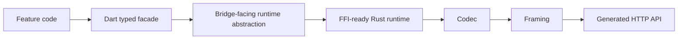
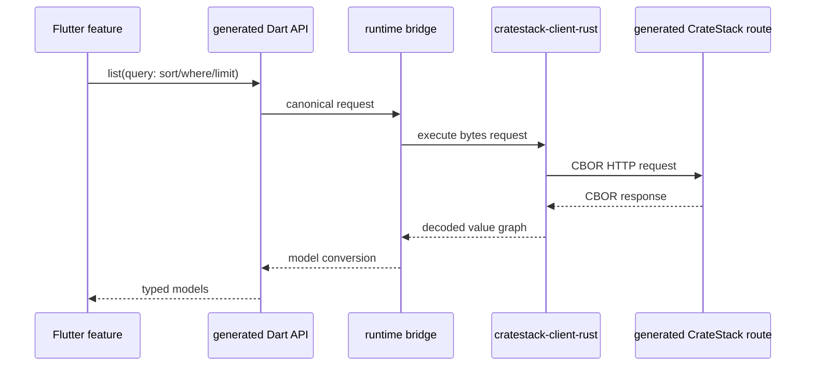

# CrateStack Client Runtime Architecture

## Status

Proposed and partially spiked.

## Why this change

CrateStack's transport contract is not JSON-first. The documented direction is:

1. generated HTTP routes remain the canonical API surface
2. CBOR is the primary codec
3. JSON stays optional and isolated
4. COSE is an envelope over codec bytes, not a codec
5. sequence transports such as `application/cbor-seq` must be treated as framing concerns, not just renamed codecs

The current `cratestack-client-dart` slice is still an experiment, but it no longer owns Dio directly. It now targets a byte-oriented bridge/runtime abstraction plus repo-managed templates, while still relying on generic value graphs for typed model conversion. That remaining typing gap is why the generated typed Dart `list` and `get` helpers intentionally stop short of claiming fully exact selection-aware response typing.

## Contract guardrails

The Rust client core must preserve these boundaries:

1. the generated HTTP API remains the public contract
2. generated client APIs are layered on top of that HTTP contract, not a private non-HTTP runtime API
3. codec, framing, and envelope handling stay explicit runtime concerns
4. typed value -> codec bytes -> framing -> optional envelope -> HTTP body remains the ordering



## Recommended crate split

### `cratestack-client-rust`

Owns the Rust runtime for generated clients.

Responsibilities:

1. HTTP execution
2. CBOR-first request and response handling in the current slice
3. negotiated JSON and CBOR support in the target slice
4. framing seam for future sequence-capable responses such as `application/cbor-seq`
5. envelope seam for future COSE support
6. request journaling and client-local persistence hooks
7. a future FFI-safe surface for Dart and Flutter wrappers
8. additive selected `get/list` helpers that keep projecting through the canonical HTTP query contract

### `cratestack-client-flutter`

Owns the Dart and Flutter-facing safe Rust wrapper over the runtime core.

Responsibilities:

1. opaque runtime lifecycle for Dart or Flutter callers
2. byte-oriented request and response wrapper types
3. a future persisted-state projection for Dart or Flutter callers
4. safe-Rust bridge methods that remain compatible with a future ABI wrapper

### `cratestack-client-dart`

Owns generated Dart contracts and typed facades that target a runtime abstraction rather than `dio` directly.

Responsibilities:

1. generated Dart models and inputs
2. generated typed APIs and query builders, including canonical query params such as `fields`, `include`, `includeFields[path]`, `sort`, `limit`, `offset`, `where`, and legacy `or`
3. a byte-oriented bridge-facing runtime abstraction plus Riverpod adapter code at the composition boundary
4. repo-managed MiniJinja templates that callers can override through a template directory
5. generated field/include constant groups so callers can assemble safer `fields` and `include` selections without stringly-typed literals everywhere

It should not become the owner of transport, codec, framing, or envelope behavior.

## Local persistence

The client runtime needs a narrow state store for durable client-side behavior.

Scope:

1. request journal
2. idempotency and replay metadata
3. local cache metadata
4. runtime schema or state version markers

Non-goals for this store:

1. general application data modeling
2. long-lived secret storage
3. replacing Flutter app databases such as Drift

### Default direction

1. SQLite-backed store for durable production use
2. JSON-file store for tests, local tooling, and narrow bootstrap slices

Current implementation note:

1. runtime config currently exposes only `InMemory` and `JsonFile`
2. the SQLite-backed store exists as `cratestack-client-store-sqlite`, and the Redis-backed store exists as `cratestack-client-store-redis`
3. Rust backend services can attach the Redis store directly with `CratestackClient::with_state_store(...)` or `with_optional_state_store(...)`; Vaam uses one Redis prefix per caller/target pair for generated backend-to-backend clients
4. neither SQLite nor Redis is yet selectable through the public Dart or Flutter runtime config surface
5. idempotency, replay metadata, and cache metadata are still deferred beyond the current request journal and state version markers

Secrets should remain behind a separate host-owned boundary instead of being merged into the general state store.

## Dart and FFI boundary

The future Dart runtime should wrap a Rust core rather than expose transport details to feature code.

Rust should own:

1. codec selection
2. framing selection
3. envelope handling
4. transport execution
5. request signing and canonicalization when enabled
6. response decoding and structured remote error mapping

Current implementation note:

1. Rust already classifies remote and transport failures in the runtime layer
2. the generated Dart package does not yet surface a first-class typed remote-error API; bridge consumers still need to treat non-success responses as a follow-up integration concern

Dart should own:

1. feature composition
2. Riverpod wiring
3. app-facing repositories and controllers
4. typed generated facades over the runtime
5. repo-managed MiniJinja templates that callers can override through a template directory
6. a generated Flutter-package-style layout with `pubspec.yaml`, root docs, `lib/`, `lib/src/`, `example/`, and `test/` instead of a single monolithic output file

Example caller shape on the Dart side:

```dart
final selection = PostSelection()
  ..id()
  ..title()
  ..author((author) => author.email());

final posts = await client.post.list(
  query: selection.toListQuery(
    sort: '-id',
    limit: 20,
    where: 'published=true',
  ),
);

final post = await client.post.get(
  1,
  query: selection.toFetchQuery(),
);
```

The typed Dart surface still exposes raw `fields`, `include`, and relation-specific `includeFields[path]`, because generated clients still ride the canonical HTTP contract directly. The ergonomic path is to express those through generated selection builders and lower them with `toListQuery(...)` or `toFetchQuery()` when you want plain model-returning calls.

Schema enums now flow through that generated surface as real Dart enums rather than plain `String` fields. Generated `fromWire()` and `toWire()` helpers map enum wire names at the package edge, while the underlying runtime still transports generic value graphs.

That means callers get typed enums at the API edge, while the transport still does the boring but reliable wire-format work underneath. 🧰

Example:

```cool
enum Role {
  admin
  member
}

type RoleFilters {
  requiredRole Role
}

procedure resolveRole(filter: RoleFilters): Role
```

becomes a generated Dart surface shaped like:

```dart
enum Role {
  admin('admin'),
  member('member');

  const Role(this.wireName);
  final String wireName;

  static Role fromWire(Object? value) { ... }
  Object toWire() => wireName;
}

class RoleFilters {
  const RoleFilters({required this.requiredRole});

  final Role requiredRole;
}

final role = await client.procedures.resolveRole(
  const ResolveRoleArgs(filter: RoleFilters(requiredRole: Role.admin)),
);
```

Why that matters in practice:

```dart
// Before
final posts = await client.post.list(
  query: const CrateStackListQuery(
    fields: [PostFieldNames.id, PostFieldNames.title],
    include: [PostIncludeNames.author],
    includeFields: {
      PostIncludeNames.author: [UserFieldNames.email],
    },
    sort: '-id',
    limit: 20,
    where: 'published=true',
  ),
);

// After
final selection = PostSelection()
  ..id()
  ..title()
  ..author((author) => author.email());

final posts = await client.post.list(
  query: selection.toListQuery(
    sort: '-id',
    limit: 20,
    where: 'published=true',
  ),
);
```

That reduces boilerplate in three ways:

1. one builder expresses root fields and nested includes together
2. relation payload trimming stays colocated with the relation itself instead of being split across `include` and `includeFields[path]`
3. screens can evolve faster because adding one more field or nested relation is just one more builder call instead of coordinated string-list edits

Recommended client-side reading:

1. use a generated selection builder plus `toListQuery(...)` or `toFetchQuery()` for most projection-shaped reads
2. drop to raw `fields`, `include`, and `includeFields[path]` only when app code needs to assemble those query parts dynamically
3. use `selection.asProjection()` with `getView(...)` or `listView(...)` when the caller should receive projected wrapper types instead of full models

Generated field/include constants still have a role. Keep them for app-owned dynamic query composition, user-configurable column or field pickers, persisted query preferences, and any code path where the query shape is not known ahead of time as one generated builder flow.

Flutter or Riverpod selection example:

```dart
final postListProvider = FutureProvider((ref) async {
  final client = ref.watch(blogClientClientProvider);
  final selection = PostSelection()
    ..id()
    ..title()
    ..author((author) => author.email());

  return client.post.list(
    query: selection.toListQuery(
      sort: '-id',
      limit: 20,
      where: 'published=true',
    ),
  );
});
```

Flutter or Riverpod projection example:

```dart
final postCardProvider = FutureProvider.family((ref, int id) async {
  final client = ref.watch(blogClientClientProvider);
  final selection = PostSelection()
    ..id()
    ..title()
    ..author((author) => author.email());

  return client.post.getView(
    id,
    projection: selection.asProjection(),
  );
});
```

Flutter or Riverpod `@@paged` full-model example:

```dart
final pagedPostsProvider = FutureProvider((ref) async {
  final client = ref.watch(blogClientClientProvider);
  final selection = PostSelection()
    ..id()
    ..title()
    ..author((author) => author.email());

  return client.post.list(
    query: selection.toListQuery(
      sort: '-id',
      limit: 20,
      offset: 0,
      where: 'published=true',
    ),
  );
});
```

Flutter or Riverpod `@@paged` projection example:

```dart
final pagedPostCardsProvider = FutureProvider((ref) async {
  final client = ref.watch(blogClientClientProvider);
  final selection = PostSelection()
    ..id()
    ..title()
    ..author((author) => author.email());

  return client.post.listView(
    projection: selection.asProjection(),
    query: const CrateStackListQuery(
      limit: 20,
      offset: 0,
      sort: '-id',
      where: 'published=true',
    ),
  );
});

String describeProjectedPage(Page<ProjectedPost> page) {
  return 'items=${page.items.length} total=${page.totalCount} hasNext=${page.pageInfo.hasNextPage}';
}
```

Flutter UI example:

```dart
class PostListScreen extends ConsumerWidget {
  const PostListScreen({super.key});

  @override
  Widget build(BuildContext context, WidgetRef ref) {
    final page = ref.watch(pagedPostsProvider);

    return Scaffold(
      appBar: AppBar(title: const Text('Posts')),
      body: page.when(
        data: (page) => Column(
          crossAxisAlignment: CrossAxisAlignment.start,
          children: [
            Padding(
              padding: const EdgeInsets.all(16),
              child: Text('Total: ${page.totalCount ?? page.items.length}'),
            ),
            Expanded(
              child: ListView.builder(
                itemCount: page.items.length,
                itemBuilder: (context, index) {
                  final post = page.items[index];
                  return ListTile(
                    title: Text(post.title),
                    subtitle: Text('hasNextPage=${page.pageInfo.hasNextPage}'),
                  );
                },
              ),
            ),
          ],
        ),
        loading: () => const Center(child: CircularProgressIndicator()),
        error: (error, _) => Center(child: Text('$error')),
      ),
    );
  }
}

class PostCardView extends ConsumerWidget {
  const PostCardView({super.key, required this.id});

  final int id;

  @override
  Widget build(BuildContext context, WidgetRef ref) {
    final post = ref.watch(postCardProvider(id));

    return post.when(
      data: (post) => Card(
        child: ListTile(
          title: Text(post.title ?? ''),
          subtitle: Text(post.author?.email ?? ''),
        ),
      ),
      loading: () => const Center(child: CircularProgressIndicator()),
      error: (error, _) => Center(child: Text('$error')),
    );
  }
}
```

For `@@paged` models:

1. `list(...)` returns `Page<Model>`
2. `listView(...)` returns `Page<ProjectedModel>`
3. the paging envelope stays stable at `items`, `totalCount`, and `pageInfo`
4. only the item type changes between full-model and projected flows

Rust-side generated caller shape:

```rust
let selection = cratestack_schema::post::select()
    .id()
    .include_author_selected(
        cratestack_schema::user::include_selection()
            .email()
            .include_profile_selected(
                cratestack_schema::profile::include_selection().nickname(),
            ),
    );

let post = cratestack_schema::client::Client::new(runtime)
    .posts()
    .get_view(&1, &selection, &[])
    .await?;

let author = post.author()?;
```

This remains intentionally nested but contract-aligned:

1. root `Selection` builders can choose root scalar fields and nested include paths
2. `IncludeSelection` builders can choose scalar fields and further nested include paths on the already-included relation
3. the generated Rust client facade still serializes only canonical HTTP query params under the hood

The first FFI-safe surface should prefer flat byte-oriented calls and opaque handles rather than exposing Rust generics or HTTP client internals over the boundary.

Because this workspace currently forbids `unsafe_code`, the first implemented slice is FFI-ready rather than a raw exported C ABI. The Rust runtime now exposes flat wire types and a blocking opaque-handle bridge in safe Rust, and `cratestack-client-flutter` now wraps that bridge for Dart or Flutter callers without introducing raw pointer code in this workspace.

## Bridge Payloads

The bridge boundary is intentionally narrower than the transport boundary.

What crosses the Dart or Flutter bridge today:

1. method, path, canonical query, and headers
2. body bytes
3. response status, headers, and body bytes

Those bridge bytes are not the HTTP transport codec bytes.

Current implemented bridge payload flow:

1. generated Dart converts typed models into generic value graphs through `toWire()`
2. Dart serializes those value graphs into bridge JSON bytes
3. Rust decodes the bridge JSON bytes into a generic value graph
4. Rust re-encodes that value graph into the configured HTTP transport codec
5. Rust applies the configured framing for the HTTP request body
6. Rust executes the HTTP request
7. Rust decodes the HTTP response bytes from the response transport selected by the server
8. Rust re-encodes that value graph into bridge JSON bytes for Dart or Flutter
9. generated Dart maps the decoded value graph back into typed models through `fromWire()`

Why this exists:

1. it removes `CrateStackWireCodec` from the generated Dart seam
2. it keeps the bridge byte-only and FFI-friendly
3. it keeps HTTP transport codec ownership in Rust
4. it avoids making Dart or Flutter aware of CBOR, JSON transport fallback, or future COSE envelopes

Canonical transport architecture and HTTP negotiation rules now live in:

1. `./transport-architecture.md`
2. `./http-transport-contract.md`

Current tradeoff:

1. the bridge still uses generic value graphs
2. the bridge still pays a JSON transcode cost internally
3. a later typed Rust bridge can remove that extra bridge-format hop without changing the generated Dart API shape again

## Runtime Transport Config

Transport configuration is runtime-wide today. The long-term direction still allows finer-grained request or route overrides where the public contract justifies them.

Current config surface:

1. `codec`
2. `envelope`

Target config surface:

1. request transport or request codec selection
2. response transport preference ordering
3. framing selection where sequence-capable routes are supported
4. envelope selection

Implemented codec values:

1. `cbor`
2. `json`

Implemented envelope values:

1. `none`

Reserved but not yet implemented:

1. `cose_sign1`

If `cose_sign1` is selected today, runtime construction fails early.

The transport ordering remains:

1. typed value
2. transport codec bytes
3. framing
4. optional envelope
5. HTTP body

The bridge JSON bytes sit outside that ordering as an internal interop format rather than a transport codec contract.

## First spike

The first spike is intentionally narrow.

Implemented in this repo:

1. a new `cratestack-client-rust` crate
2. CBOR-first request and response handling through `cratestack-codec-cbor`
3. request journaling through a `ClientStateStore` trait
4. an in-memory store plus a JSON-file store for bootstrap and tests
5. dedicated `cratestack-client-store-sqlite` and `cratestack-client-store-redis` crates for durable request-journal and state-version persistence
6. an FFI-ready runtime bridge with flat request, response, header, config, and error wire types
7. a new `cratestack-client-flutter` crate that wraps the runtime bridge with safe Rust APIs for Dart or Flutter consumers
8. one successful procedure call against generated Axum-compatible CBOR routes
9. one CRUD error-path call against generated Axum-compatible CBOR routes
10. a generated Dart runtime that now targets a byte-oriented bridge instead of owning Dio directly
11. canonical typed Dart query helpers for `fields`, `include`, relation-specific `includeFields[path]`, `sort`, `limit`, `offset`, grouped `where=`, legacy `or=`, and resource-specific filters, plus per-model field/include constants for safer selection assembly
12. generated Dart selection builders plus projection wrappers for `getView` / `listView`
13. request-authorizer hooks in `cratestack-client-rust` built around canonical request strings plus encoded request body bytes so host integrations can attach signed-request headers without changing generated clients
14. runtime-wide transport config for `cbor` and `json`, with a reserved future envelope seam
15. documented target-state transport layering across codec, framing, and envelope, including a future `application/cbor-seq` path
16. removal of `CrateStackWireCodec` from the generated Dart seam



Deferred from the spike:

1. a raw exported ABI wrapper for Dart or Flutter FFI consumers
2. COSE implementation
3. COSE envelope implementation beyond the current request-authorizer trust hook
4. full generated Rust typed delegates over this runtime beyond the current additive selected `get/list` helpers
5. moving the generated Dart model conversion layer fully off generic value graphs
6. replacing bridge JSON bytes with a more direct typed bridge when that cost becomes worth paying
7. exposing persisted state through the Flutter-facing wrapper and generated Dart-facing runtime integrations
8. wiring the SQLite store into the public runtime config surface

## Current implementation note

The current `cratestack-client-dart` crate should be treated as an experimental runtime-oriented and bridge-facing slice. It no longer owns Dio directly, renders through repo-managed templates that callers can override, and still uses generic value graphs for typed model conversion while the Rust-owned bridge and codec story continues to mature. The generated Dart APIs now expose canonical projection query options plus selection builders and projection wrappers for projected reads. On the Rust side, `cratestack-client-rust` now exposes additive request-authorizer hooks and a generated schema-native client facade over the same runtime. `include_schema!` emits that facade alongside server/database code; `include_client_macro!` emits only client-facing Rust types, inputs, selection builders, procedure payloads, and the reqwest-backed facade for callers that only need to talk to another CrateStack HTTP service. Selection-aware response typing is still intentionally incomplete overall, so callers should treat these projections as a contract-aligned safety improvement rather than assuming every narrowed selection is perfectly type-level exact. Runtime state persistence is provided through the base in-memory and JSON-file stores, plus opt-in SQLite and Redis store crates.

## Examples

### Rust Runtime Config

CBOR-first transport with no envelope:

```rust
use cratestack_client_rust::{
    RuntimeCodecConfig, RuntimeConfigWire, RuntimeEnvelopeConfig,
    RuntimeStateStoreConfig, RuntimeTransportConfig,
};

let config = RuntimeConfigWire {
    base_url: "https://api.example.com".to_owned(),
    state_store: RuntimeStateStoreConfig::InMemory,
    transport: RuntimeTransportConfig {
        codec: RuntimeCodecConfig::Cbor,
        envelope: RuntimeEnvelopeConfig::None,
    },
};
```

### Rust Client-Only Schema

Backend-to-backend callers should prefer `include_client_macro!` when they consume another service's `.cstack` schema but do not own its database, routes, policies, procedure registry, custom-field resolvers, or event subscriptions. CBOR should be the default backend-to-backend codec; JSON is for debugging, tests, and compatibility paths unless a service explicitly documents otherwise.

```rust
use cratestack::include_client_macro;
use cratestack::client_rust::{CborCodec, ClientConfig, CratestackClient};

include_client_macro!("../payment-gateway/schema/payment.cstack");

let base_url = url::Url::parse("http://payment-gateway:3000")?;
let runtime = CratestackClient::new(ClientConfig::new(base_url), CborCodec);
let payment = cratestack_schema::client::Client::new(runtime);

let result = payment
    .procedures()
    .supported_payment_providers(
        &cratestack_schema::procedures::supported_payment_providers::Args::default(),
        &[("authorization", authorization.as_str())],
    )
    .await?;
```

The generated facade still uses the canonical HTTP contract underneath: model clients call generated REST CRUD routes, procedure clients call `/$procs/{procedureName}`, and projection helpers lower selected reads into `fields`, `include`, and `includeFields[path]` query params. OAuth2 protocol endpoints are intentionally outside `.cstack` and should remain handwritten protocol integrations rather than generated CrateStack clients.

JSON transport fallback with no envelope:

```rust
use cratestack_client_rust::{
    RuntimeCodecConfig, RuntimeConfigWire, RuntimeEnvelopeConfig,
    RuntimeStateStoreConfig, RuntimeTransportConfig,
};

let config = RuntimeConfigWire {
    base_url: "https://api.example.com".to_owned(),
    state_store: RuntimeStateStoreConfig::JsonFile {
        path: "cratestack/tmp/runtime-state.json".into(),
    },
    transport: RuntimeTransportConfig {
        codec: RuntimeCodecConfig::Json,
        envelope: RuntimeEnvelopeConfig::None,
    },
};
```

### Rust Redis State Store

Server-side Rust clients can opt into Redis-backed request journaling without adding Redis to the base runtime crate:

```rust
use std::sync::Arc;
use cratestack_client_rust::{CborCodec, ClientConfig, CratestackClient};
use cratestack_client_store_redis::RedisStateStore;

let base_url = url::Url::parse("http://payment-gateway:3000")?;
let store = Arc::new(RedisStateStore::open(
    "redis://127.0.0.1:6379/",
    "cratestack:clients:payment-gateway",
)?);
let runtime = CratestackClient::new(ClientConfig::new(base_url), CborCodec)
    .with_state_store(store);
```

The Redis store uses `{prefix}:meta` for `schema_version`, `state_version`, and `updated_at`, plus `{prefix}:request_journal` as an append-only Redis list of JSON-encoded `RequestJournalEntry` values. `append_request_journal` uses an atomic Redis pipeline to push the journal entry and increment `state_version`.

### Flutter Wrapper Config

```rust
use cratestack_client_flutter::{
    FlutterRuntimeCodec, FlutterRuntimeConfig, FlutterRuntimeEnvelope,
    FlutterRuntimeTransportConfig, FlutterStateStoreConfig,
};

let config = FlutterRuntimeConfig {
    base_url: "https://api.example.com".to_owned(),
    state_store: FlutterStateStoreConfig::InMemory,
    transport: FlutterRuntimeTransportConfig {
        codec: FlutterRuntimeCodec::Cbor,
        envelope: FlutterRuntimeEnvelope::None,
    },
};
```

## `vaam-mobile` Integration Path

For `frontends/vaam-mobile`, treat the generated package and the runtime bridge as separate concerns.

### What works today

1. generate the Flutter-shaped package into `frontends/vaam-mobile/packages/<client_name>`
2. add it as a path dependency in the mobile app
3. provide a `CrateStackRuntimeBridge` implementation from the app side
4. override the generated Riverpod bridge provider

From `cratestack/`, generation looks like:

```bash
cargo run -p cratestack-cli -- generate-dart \
  --schema "crates/cratestack/tests/fixtures/blog.cool" \
  --out "../frontends/vaam-mobile/packages/blog_client" \
  --library-name blog_client \
  --base-path "/api"
```

Then wire the generated provider in Flutter:

```dart
ProviderScope(
  overrides: [
    blogClientRuntimeBridgeProvider.overrideWith((ref) => myBridge),
    blogClientBasePathProvider.overrideWith((ref) => '/api'),
  ],
  child: const App(),
)
```

### Intended future path

The generated Dart package should remain stable while the bridge implementation moves closer to the final Rust-owned runtime path.

That future path keeps these concerns in Rust:

1. transport codec selection such as `cbor` or `json`
2. future COSE envelope behavior
3. future signing and canonicalization
4. runtime persistence choices

### Current recommendation for `vaam-mobile`

Use the generated package API today, but treat the bridge as the integration seam that will later swap from app-owned wiring to a fuller Rust-backed runtime bridge.

### Generated Dart Usage

```dart
final blogClient = BlogClientCrateStackClient(
  CrateStackRuntime(myBridge),
  basePath: '/api',
);

final selection = PostSelection()
  ..id()
  ..title();

final posts = await blogClient.posts.list(
  query: selection.toListQuery(sort: 'title'),
);

final post = await blogClient.posts.create(
  const CreatePostInput(title: 'Hello', published: true, authorId: 7),
);

final feed = await blogClient.procedures.getFeed(
  const GetFeedArgs(limit: 10),
);

final publishedPost = await blogClient.procedures.publishPost(
  const PublishPostArgs(
    args: PublishPostInput(postId: 1),
  ),
);
```

In that flow:

1. Dart converts `CreatePostInput` into a generic value graph through `toWire()`
2. Dart serializes that value graph into bridge JSON bytes
3. Rust converts those bytes into the configured HTTP transport codec
4. Rust performs the HTTP request and decodes the response
5. Rust returns bridge JSON bytes
6. Dart reconstructs typed models through `fromWire()`

That same regeneration flow is also the answer when generated packages lag behind schema changes: re-run `cratestack-cli generate-dart` for the target package after changing the `.cool` schema or the generator/templates.

Example:

```bash
cargo run -p cratestack-cli -- generate-dart \
  --schema "../vaam-backends/services/auth-service/schema/auth.cool" \
  --out "../frontends/vaam-mobile/packages/gen_auth_client" \
  --library-name gen_auth_client \
  --base-path "/api"
```

Current enum limitation:

1. generated Rust and Dart clients understand schema enums
2. read-policy literal lowering still only accepts required `Boolean`, `Int`, and `String` fields for literal comparisons at macro expansion time
3. to support enum fields in expressions like `field == "active"` or `auth().role == "admin"`, extend macro lowering to recognize required enum fields and lower those literals as string-backed policy literals

So the current rule of thumb is simple:

1. use enums freely for generated client-facing data shapes
2. be more careful when the same field is compared against string literals inside schema policies

Concrete boundary example:

```cool
enum PaymentInstrumentStatus {
  active
  inactive
}

model PaymentInstrument {
  id String @id
  status PaymentInstrumentStatus
}
```

This is supported for generated Rust and Dart clients.

```cool
enum Role {
  admin
  user
}

auth SessionUser {
  role Role
}

model AdminOnlyView {
  id String @id

  @@allow("read", auth().role == "admin")
}
```

This still needs the policy-literal lowering extension described above.

## Use Cases

### 1. Default Mobile Client

Use when:

1. the backend speaks CBOR by default
2. the app should not know about CBOR or COSE details
3. the app needs typed generated Dart APIs and Riverpod wiring

Recommended config:

1. codec: `cbor`
2. envelope: `none`
3. state store: in-memory during bootstrap, SQLite once durable mobile storage is required

### 2. Compatibility or Gateway Mode

Use when:

1. an integration point only accepts JSON transport
2. the same generated client surface should remain usable

Recommended config:

1. codec: `json`
2. envelope: `none`

The generated Dart APIs do not change. Only the Rust runtime config changes.

## Current Gaps

The most important client-side features that still are not implemented end-to-end are:

1. a raw exported ABI wrapper for direct Dart FFI consumers
2. COSE envelope support
3. request signing and canonicalization on the runtime path
4. generated typed Rust client output comparable to the generated Dart package output
5. a public Flutter or Dart-facing persisted-state API
6. runtime-configurable SQLite state-store selection from the Flutter-facing wrapper
7. a first-class typed remote-error surface in the generated Dart APIs
8. fully selection-aware response typing when `fields`, `include`, and `includeFields[path]` narrow or reshape payloads

### 3. Future Signed or Enveloped Transport

Use when:

1. requests or responses must be wrapped in COSE
2. the app still should not implement envelope behavior in Dart or Flutter

Intended config:

1. codec: `cbor` or `json`
2. envelope: `cose_sign1`

This is not implemented yet, but the config seam is already reserved so the generated Dart API does not need another architecture change when envelope support lands.
