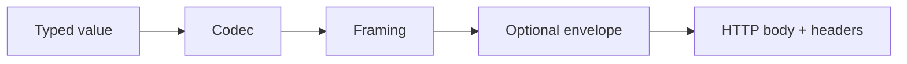

# CoolStack Transport Architecture

## Status

Proposed target architecture. This document is the canonical transport design reference to use before changing routing, client runtime, or generated contracts.

Current implementation is narrower than this design:

1. generated Axum routers currently enforce a single configured codec per router
2. CBOR is the only first-party checked-in server codec crate today
3. JSON support currently exists inline in `coolstack-client-rust` rather than as a dedicated codec crate
4. COSE remains an unimplemented envelope seam
5. `application/cbor-seq` is not implemented yet

## Purpose

CoolStack needs a transport model that stays correct as the project grows from today's CBOR-first bootstrap slice to a broader multi-client, multi-service, and optional signed-envelope platform.

This document fixes the architecture vocabulary first so implementation work does not blur distinct concerns.

## Core Model

CoolStack transport is composed from three separate layers:

1. codec
2. framing
3. envelope

These layers must remain separate in docs, runtime code, generated routes, and client configuration.

## Definitions

### Codec

A codec converts a typed value graph into bytes and back.

Examples:

1. JSON
2. CBOR

Codec responsibilities:

1. value serialization and deserialization
2. codec-specific content rules
3. typed error reporting for encode and decode failures

Codec non-responsibilities:

1. request authentication
2. response negotiation policy
3. body streaming semantics
4. signing or encryption

### Framing

Framing defines how one or more encoded values are arranged inside a single HTTP body.

Examples:

1. single value
2. sequence

Framing responsibilities:

1. define whether a body contains one payload or many
2. define how multiple payloads are delimited or concatenated
3. constrain which endpoints can legally use the framing mode

Framing non-responsibilities:

1. typed value serialization rules
2. cryptographic protection

### Envelope

An envelope wraps already-encoded and already-framed bytes.

Examples:

1. none
2. COSE Sign1 in a future implementation

Envelope responsibilities:

1. sealing and opening transport bytes
2. binding transport bytes to signatures or future cryptographic metadata
3. optionally using auth context or host-provided signing material

Envelope non-responsibilities:

1. primary typed serialization format
2. list versus sequence semantics

## Design Rules

### Rule 1: COSE is an envelope, not a codec

COSE must not be modeled as a peer alternative to CBOR or JSON.

Correct model:

1. choose codec
2. choose framing
3. optionally apply COSE

Incorrect model:

1. choose one of JSON, CBOR, COSE

This distinction matters because COSE protects bytes that were already produced by an inner transport representation.

### Rule 2: `application/cbor-seq` is not just another codec label

`application/cbor` and `application/cbor-seq` share a CBOR value model, but they do not have the same body semantics.

1. `application/cbor` means one CBOR data item per body
2. `application/cbor-seq` means multiple top-level CBOR data items in sequence

That means `cbor-seq` belongs at the framing layer, even if media-type handling ends up representing it as a distinct transport option in code.

### Rule 3: Transport capability is route-specific

Not every generated route should support every transport shape.

Examples:

1. `GET /products/{id}` is naturally a single-value response
2. `POST /products` is naturally a single-value request and response
3. an export, feed, or watch procedure may support sequence responses

The runtime must allow route capabilities to be narrower than the full registry of installed codecs and framings.

### Rule 4: Request and response negotiation are related but separate

For HTTP:

1. request decoding is driven by `Content-Type`
2. response encoding is driven by `Accept`

The server must not assume that the request body codec and the response body codec are always the same, even if many clients choose to align them.

### Rule 5: Error bodies follow the negotiated response transport

Once the server has successfully selected a response transport, both success and error bodies should use it.

Before response transport selection is possible, the server may fall back to a plain text or minimal host-defined error response only for truly pre-negotiation failures.

## Media-Type Direction

### Implemented today

1. `application/cbor` on generated server routes when a router is built with `CborCodec`

### Planned first-class media types

1. `application/json`
2. `application/cbor`

### Planned framing-aware media types

1. `application/cbor-seq`

### Planned future envelope-aware media types

This repo has not yet committed to final envelope media types for COSE-wrapped payloads. That decision must happen explicitly rather than being implied by implementation.

Questions to settle before COSE implementation:

1. whether the outer response type is a generic COSE media type or a CoolStack-specific profile
2. how the inner codec and framing are declared or discoverable
3. whether some routes require envelopes while others merely allow them

## Recommended Runtime Shape

The current `CoolCodec` and `CoolEnvelope` split is still directionally correct, but it is not sufficient on its own for content negotiation and sequence framing.

The long-term runtime should represent three concepts:

1. codec registry
2. framing policy
3. envelope policy

One acceptable shape is:

1. keep `CoolCodec` for typed encoding
2. add a framing abstraction for single versus sequence bodies
3. keep `CoolEnvelope` for post-framing wrapping
4. add a transport selector or registry that resolves request and response behavior from HTTP headers plus route capability metadata

The implementation does not need to adopt those exact trait names, but the architectural split must remain visible.

## Route Capability Model

Generated routes should eventually declare transport capabilities instead of inheriting one implicit codec for every path.

A route capability model should answer:

1. which request media types are accepted
2. which response media types are supported
3. whether sequence responses are allowed
4. whether an envelope is optional, forbidden, or required

Illustrative capability matrix:

| Route shape | Request transport | Response transport |
| --- | --- | --- |
| `GET /products/{id}` | none | JSON, CBOR |
| `POST /products` | JSON, CBOR | JSON, CBOR |
| `GET /products` | none | JSON, CBOR, maybe CBOR sequence |
| `POST /$procs/exportProducts` | JSON, CBOR | CBOR sequence |

This table is directional guidance, not a hard commitment that list routes must always support sequence framing.

## `cbor-seq` Guidance

`application/cbor-seq` should be introduced as a selective transport mode rather than a blanket replacement for list responses.

Good early fits:

1. export procedures
2. event feeds
3. watch or tail style responses
4. large result streams where incremental processing matters

Poor early fits:

1. standard CRUD create or update requests
2. simple detail fetches
3. small procedure responses that already fit the single-value model cleanly

Recommended rollout:

1. implement negotiated JSON and CBOR single-value transport first
2. add route capability metadata
3. add response-side `cbor-seq` for explicitly sequence-oriented endpoints
4. consider request-side `cbor-seq` only after a concrete use case exists

## Client Architecture Direction

Clients should mirror the same transport split.

Client responsibilities:

1. choose a request transport explicitly when a request body exists
2. advertise one or more acceptable response transports
3. decode responses based on actual response `Content-Type`
4. expose explicit sequence APIs instead of forcing sequence responses through single-value decode helpers

Recommended client defaults:

1. default request transport: CBOR for internal first-party clients
2. default accepted response transports: CBOR first, JSON second
3. optional route- or request-level override when interoperability needs differ

Sequence responses should eventually use explicit client APIs such as a buffered list helper first, with streaming APIs added later when the runtime is ready.

## Current Repo Mapping

This document is intentionally ahead of the current checked-in implementation.

Current repo reality:

1. generated Axum routes currently validate `Accept` and `Content-Type` against one configured codec
2. `coolstack-codec-cbor` is the only dedicated checked-in codec crate
3. JSON codec support exists inline in `coolstack-client-rust`
4. `coolstack-client-rust` and `coolstack-client-flutter` already expose runtime codec configuration for CBOR and JSON, but each client instance still operates as a single-codec transport client
5. COSE envelope configuration exists as a reserved runtime option, but the runtime rejects it because implementation is missing

## Implementation Phasing

Recommended order:

1. document the transport model and HTTP contract first
2. add a dedicated JSON codec crate
3. add negotiated JSON and CBOR request and response handling for generated routes
4. update Rust client decoding to respect actual response `Content-Type`
5. expose response preference ordering in client runtime config
6. add route capability metadata for transport support
7. add selective `application/cbor-seq` support for sequence-oriented routes
8. add COSE envelope support only after codec and framing boundaries are proven in code

## Non-Goals For The First Transport Expansion

1. supporting every route under every media type from day one
2. implementing COSE and multi-codec negotiation in the same patch set
3. treating sequence framing as required for all list endpoints
4. hiding transport differences behind vague automatic magic that clients cannot reason about

## Canonical Companion Document

`./http-transport-contract.md` should be read alongside this document. This architecture file explains the model and boundaries. The HTTP contract file explains concrete request, response, and negotiation behavior.
