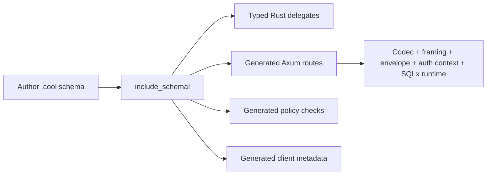

# CoolStack v0 PRD

## 1. Product Summary

CoolStack is a Rust-native, schema-first backend framework layer for building typed database-backed HTTP REST APIs, generated clients, declarative authorization policies, and custom business procedures.

Developers define their data model, authorization rules, field exposure directives, custom fields, and procedures in `.cool` schema files, then include them in Rust using:

```rust
coolstack::include_schema!("schema.cool");
```

The macro generates a typed ORM client, canonical REST CRUD routes, procedure interfaces, request/response types, generated client metadata, and policy enforcement code. CoolStack uses `sqlx` behind the scenes for database access and supports pluggable transport composition so applications can use JSON, CBOR, sequence-aware transports such as `application/cbor-seq`, and future COSE envelopes without sacrificing developer experience.

CoolStack v0 is intentionally focused:

* Rust-first
* PostgreSQL-first
* Axum-first
* SQLx-backed
* HTTP REST only
* Schema-defined ORM models
* Schema-defined authorization policies
* Schema-defined CRUD exposure controls
* Schema-defined field visibility and filterability controls
* Schema-defined custom fields
* Schema-defined procedures
* Framework-delegated authentication
* Pluggable codecs
* Pluggable framing
* Optional COSE envelope support
* Generated Rust clients as a first-class output

CoolStack v0 does not attempt to provide RPC, GraphQL, a full plugin marketplace, or built-in authentication.

---

## 2. Problem Statement

Rust backend developers often need to repeatedly build the same foundation across projects:

* database models
* typed query APIs
* REST CRUD endpoints
* request and response structs
* authorization checks
* business procedures
* stable internal client libraries
* pagination and filtering
* serialization format handling
* framework integration

Existing Rust ORMs and web frameworks are powerful, but they usually require significant manual wiring between schema, database, authorization, and HTTP transport. Many systems also assume JSON as the default wire format, which is unacceptable for projects that require CBOR and COSE.

CoolStack solves this by making the schema the source of truth and generating the surrounding Rust API, REST layer, and client contracts while keeping authentication, transport encoding, and cryptographic wrapping configurable.

### 2.1 Representative Use Cases

1. Internal catalog or CMS service
Teams can define models, policies, and procedures once, then get generated CRUD routes and typed Rust delegates without hand-writing every handler and query parser.

2. CBOR-first service boundary
Platforms that do not want to normalize around JSON can keep generated HTTP APIs and clients aligned with a CBOR-first contract from day one.

3. Policy-heavy content or workflow APIs
Applications can encode data visibility rules such as `published || authorId == auth().id` in schema policy declarations instead of duplicating checks across handlers and queries.

4. Shared server and client contract generation
Teams can use a `.cool` schema to drive generated routes, Rust delegate usage, and experimental generated client outputs from the same source of truth.

---

## 3. Goals

### 3.1 Product Goals

1. Let developers define data models and policies in `.cool` files.
2. Generate a typed Rust ORM client from the schema.
3. Generate canonical HTTP REST CRUD routes for schema models.
4. Support schema-configurable CRUD exposure per model and per operation.
5. Support separate schema directives for field visibility and filterability.
6. Support custom schema-defined procedures for business logic.
7. Enforce model-level and procedure-level permissions.
8. Delegate authentication to the host framework or application.
9. Avoid forcing JSON as the wire format.
10. Support JSON and CBOR as first-class codecs.
11. Support framing-aware transports, including `application/cbor-seq`, where route semantics justify them.
12. Support COSE as a transport envelope layer.
13. Use SQLx behind the scenes for database execution.
14. Generate Rust clients for the canonical HTTP APIs.
15. Provide a clean `include_schema!` developer experience.
16. Support resolver-backed custom fields.

### 3.2 Developer Experience Goals

The ideal developer flow:



```rust
coolstack::include_schema!("schema.cool");

#[tokio::main]
async fn main() -> anyhow::Result<()> {
    let pool = sqlx::PgPool::connect(&std::env::var("DATABASE_URL")?).await?;

    let cool = coolstack_schema::Coolstack::builder(pool)
        .codec(coolstack_codec_cbor::CborCodec::default())
        .procedures(AppProcedures)
        .build();

    let app = axum::Router::new().nest(
        "/api",
        coolstack_schema::axum::router(
            cool,
            AppProcedures,
            coolstack_codec_cbor::CborCodec,
            resolve_context,
        ),
    );

    Ok(())
}
```

The developer defines a `.cool` file, implements generated procedure traits and custom-field resolver traits, provides authentication context through the framework, and gets REST endpoints plus a typed ORM and generated client contracts.

Canonical transport design and HTTP negotiation rules are documented in:

1. `../architecture/transport-architecture.md`
2. `../architecture/http-transport-contract.md`

---

## 4. Non-Goals for v0

CoolStack v0 explicitly does not include:

1. RPC transport.
2. GraphQL.
3. schema-first transport and client generation remain the core outputs.
4. Production-stable non-Rust client generation in the initial slice.
5. Built-in authentication.
6. Session management.
7. OAuth, JWT, password hashing, or login flows.
8. Multi-database support beyond PostgreSQL.
9. A complete migration engine.
10. Polymorphic models.
11. Deep nested writes.
12. Advanced include trees.
13. A broad plugin marketplace.
14. `as_system` or superuser bypass APIs.
15. Automatic policy bypass inside procedures.
16. Prisma compatibility as a formal goal.
17. ZenStack compatibility as a formal goal.

---

## 5. Target Users

### 5.1 Primary Users

Rust backend developers who want:

* typed database access
* generated REST endpoints
* schema-driven authorization
* framework-level authentication integration
* CBOR/COSE-capable HTTP APIs
* low-boilerplate CRUD and business procedure support

### 5.2 Secondary Users

Teams building:

* internal services
* secure APIs
* embedded or constrained-environment backends
* public REST APIs requiring non-JSON formats
* policy-heavy data services

---

## 6. Core Concepts

### 6.1 `.cool` Schema

The `.cool` schema is the source of truth for:

* datasource configuration
* auth context shape
* database models
* fields
* relations
* constraints
* model-level permissions
* CRUD exposure controls
* field visibility rules
* field filterability rules
* model event emission directives
* custom-field resolution declarations
* custom input/output types
* procedures
* procedure-level permissions

### 6.2 ORM Client

CoolStack generates a typed Rust ORM client with model delegates:

```rust
let posts = cool
    .post()
    .find_many()
    .where_(post::published().eq(true))
    .limit(20)
    .run(&ctx)
    .await?;
```

Builder-style relation DSL example:

```rust
let visible_posts = cool
    .post()
    .find_many()
    .where_expr(
        coolstack_schema::post::author()
            .profile()
            .nickname()
            .eq("Zulu")
            .and(coolstack_schema::post::published().is_true())
            .not(),
    )
    .order_by(coolstack_schema::post::author().email().desc())
    .run(&ctx)
    .await?;
```

### 6.3 REST CRUD

CoolStack generates conventional REST endpoints for models:

```text
GET    /api/posts
GET    /api/posts/:id
POST   /api/posts
PATCH  /api/posts/:id
DELETE /api/posts/:id
```

Per-model exposure is schema-configurable. A model may expose all CRUD operations, only a protected subset, public read-only routes, or no generated CRUD at all.

Raw HTTP examples for the current slice:

```bash
curl \
  -H 'Accept: application/cbor' \
  'http://127.0.0.1:3000/api/posts?fields=id,title&sort=-id&limit=20'

curl \
  -H 'Accept: application/cbor' \
  -H 'x-auth-id: 1' \
  'http://127.0.0.1:3000/api/posts?include=author&where=author.email=owner@example.com'

curl \
  -H 'Accept: application/cbor' \
  -H 'x-auth-id: 1' \
  'http://127.0.0.1:3000/api/posts?where=not(author.profile.nickname=Zulu,published=true)'
```

### 6.4 Procedures

Procedures are schema-defined custom business operations implemented by the application.

Example:

```cool
mutation procedure publishPost(args: PublishPostInput): Post
  @allow(auth().role == "admin")
```

Generated Rust trait:

```rust
#[async_trait::async_trait]
pub trait CoolProcedures: Send + Sync + 'static {
    async fn publish_post(
        &self,
        db: &Coolstack,
        ctx: &coolstack::CoolContext,
        args: PublishPostInput,
    ) -> Result<Post, coolstack::CoolError>;
}
```

REST endpoint:

```text
POST /api/$procs/publishPost
```

All non-CRUD business behavior should be represented as schema-declared procedures. Procedures are not an escape hatch around the schema; they are part of the schema contract.

### 6.5 Permissions

Permissions are schema-defined authorization rules.

Model example:

```cool
@@allow("read", published || authorId == auth().id)
@@allow("update", authorId == auth().id)
@@allow("delete", auth().role == "admin")
```

Procedure example:

```cool
mutation procedure publishPost(args: PublishPostInput): Post
  @allow(auth().role == "admin")
```

Default rule:

```text
No matching allow rule means deny.
```

### 6.6 Authentication Delegation

CoolStack does not authenticate users.

The host application or framework is responsible for:

* login
* sessions
* JWT verification
* cookies

### 6.7 Custom Fields

Schemas may declare resolver-backed custom fields:

```cool
type Image {
  storageKey String
  thumbnailUrl String @custom
}
```

The framework generates a resolver trait for custom fields so that applications can derive values such as `thumbnailUrl` from internal infrastructure like imgproxy without making that wiring part of every handler.

### 6.8 Generated Clients

Generated HTTP routes are the normal API surface of a CoolStack service.

The framework should generate:

* a Rust async client first
* a Dart client later, designed for Riverpod-based frontends

Generated Rust clients should expose both high-level typed operations and a lower-level request-builder escape hatch.
* OAuth
* user lookup

CoolStack only consumes a `CoolContext` that represents the already-authenticated request identity.

### 6.7 Codec

A codec converts typed Rust values to and from HTTP request/response bodies.

Examples:

* CBOR
* JSON, optional only
* MessagePack, possible later

### 6.8 Envelope

An envelope wraps already-encoded bytes for signing, verification, encryption, or MAC operations.

Examples:

* no envelope
* COSE_Sign1
* COSE_Encrypt0
* COSE_Mac0

CBOR and COSE are intentionally separate:

```text
Rust type -> CBOR bytes -> COSE envelope -> HTTP response
HTTP request -> COSE open -> CBOR decode -> Rust type
```

---

## 7. Example Schema

```cool
datasource db {
  provider = "postgresql"
  url = env("DATABASE_URL")
}

auth User {
  id   Int
  role String
}

model User {
  id    Int    @id @default(autoincrement())
  email String @unique
  name  String?
  role  String

  @@allow("read", auth() != null)
}

model Post {
  id        Int     @id @default(autoincrement())
  title     String
  published Boolean @default(false)
  authorId  Int

  @@allow("read", published || authorId == auth().id)
  @@allow("create", auth() != null)
  @@allow("update", authorId == auth().id)
  @@allow("delete", auth().role == "admin")
}

type SignUpInput {
  email String
  name  String?
}

type PublishPostInput {
  postId Int
}

procedure getFeed(limit: Int?): Post[]
  @allow(auth() != null)

procedure getFeedPage(limit: Int?, offset: Int?): Page<Post>
  @allow(auth() != null)

mutation procedure signUp(args: SignUpInput): User
  @allow(true)

mutation procedure publishPost(args: PublishPostInput): Post
  @allow(auth().role == "admin")
```

---

## 8. Functional Requirements

## 8.1 Schema Parsing

CoolStack must parse `.cool` files containing:

* datasource blocks
* auth blocks
* model blocks
* type blocks
* procedure declarations
* mutation procedure declarations
* scalar fields
* optional fields
* list fields
* model attributes
* field attributes
* permission expressions

### Required scalar types for v0

```text
String
Int
Float
Boolean
DateTime
Json
Bytes
Uuid
```

`Json` is a database/value type only. It must not imply JSON as the HTTP wire format.

### Required field attributes for v0

```text
@id
@default(...)
@unique
@relation(...)
```

### Required model attributes for v0

```text
@@allow(action, expression)
@@paged
@@unique([...])
@@index([...])
```

Current `@@paged` boundary:

* `@@paged` is a bare model-level opt-in only
* it only changes the generated top-level list route for that model
* generated `GET /{models}` responses become `Page<Model>` instead of `Model[]`
* generated Rust and Dart model `list(...)` and `listSelected(...)` clients follow the same paged contract
* paging is still offset-based through `limit` and `offset`
* nested relation collections and detail routes are unaffected

### Required procedure attributes for v0

```text
@allow(expression)
```

Built-in container return type currently supported in procedure returns:

```text
Page<T>
```

Current `Page<T>` boundary:

* only supported on procedure return types
* `T` must be a declared model or `type`
* generated wire shape is `items`, `totalCount`, and `pageInfo`

Explicit non-goals for the current slice:

* no user-defined generic schema types such as `type Foo<T>`
* no scalar page items such as `Page<Int>`
* no nested page containers such as `Page<Page<Post>>`
* no optional or list-wrapped page containers such as `Page<Post>?` or `Page<Post>[]`
* no `Page<T>` support on model fields, type fields, auth fields, or procedure arguments
* no alternative built-in paged container variations beyond the canonical `Page<T>` envelope above

---

## 8.2 Semantic Analysis

CoolStack must validate:

1. duplicate model names
2. duplicate type names
3. duplicate field names
4. unknown field types
5. invalid scalar types
6. invalid relation references
7. missing primary keys
8. invalid policy actions
9. invalid auth field references
10. invalid model field references in policies
11. invalid procedure input types
12. invalid procedure return types
13. duplicate procedure names
14. unsupported database provider values

Semantic errors should produce compiler-style diagnostics that identify the file location when possible.

---

## 8.3 Macro Integration

The primary integration point is:

```rust
coolstack::include_schema!("schema.cool");
```

The macro must:

1. read the schema file relative to `CARGO_MANIFEST_DIR`
2. parse the schema
3. analyze the schema
4. generate Rust modules and types
5. generate ORM delegates
6. generate policy code
7. generate procedure traits
8. generate REST routes
9. trigger recompilation when the schema changes

Generated module name for v0:

```rust
coolstack_schema
```

Generated surface:

```rust
coolstack_schema::Coolstack
coolstack_schema::routes
coolstack_schema::models
coolstack_schema::post
coolstack_schema::user
coolstack_schema::CoolProcedures
```

---

## 8.4 ORM Requirements

### 8.4.1 Generated Delegates

For each model, generate a delegate:

```rust
cool.user()
cool.post()
```

Required methods:

```rust
find_many()
find_unique(id)
create(input)
update(id)
delete(id)
```

### 8.4.2 Query Features for v0

Required:

* equality filters
* boolean filters
* simple string filters
* ordering
* limit
* offset
* primary-key lookup

Optional but desirable:

* `contains`
* `starts_with`
* `ends_with`
* `in`
* `not_in`

### 8.4.3 SQL Backend

CoolStack v0 must use SQLx behind the scenes.

Recommended implementation:

* `sqlx::PgPool`
* `sqlx::QueryBuilder<Postgres>`
* generated `sqlx::FromRow` structs
* dynamic SQL for filters and policies

Compile-time SQLx macros are not required for generated dynamic queries.

### 8.4.4 Policy Injection

Read, update, and delete policies must be injected into SQL where possible.

Example policy:

```cool
@@allow("update", authorId == auth().id)
```

Should produce SQL behavior equivalent to:

```sql
UPDATE posts
SET ...
WHERE id = $1
AND author_id = $auth_user_id
RETURNING *
```

Create policies may be checked before insert using the decoded input and auth context.

---

## 8.5 Permission Requirements

### 8.5.1 Supported Actions

Model permissions support:

```text
read
create
update
delete
```

Procedure permissions support:

```text
execute
```

The schema syntax may omit the explicit action for procedures:

```cool
@allow(auth() != null)
```

### 8.5.2 Default Deny

If no applicable allow rule exists, the operation must be denied.

### 8.5.3 Multiple Allow Rules

Multiple allow rules for the same action are OR-combined.

Example:

```cool
@@allow("read", published)
@@allow("read", authorId == auth().id)
```

Equivalent:

```text
published OR authorId == auth().id
```

### 8.5.4 Auth Context

Policies may reference:

```cool
auth()
auth().id
auth().role
```

`auth() == null` means unauthenticated.

`auth() != null` means authenticated.

### 8.5.5 Procedure Permissions

Procedure-level permissions are checked before calling the application-provided procedure implementation.

Example:

```cool
mutation procedure publishPost(args: PublishPostInput): Post
  @allow(auth().role == "admin")
```

Generated handler behavior:

```text
1. decode request
2. extract context
3. check procedure permission
4. call handler implementation
5. encode response
```

### 8.5.6 No System Bypass in v0

CoolStack v0 must not provide:

```rust
db.as_system()
```

Procedures use the same policy-protected ORM methods as all other code.

---

## 8.6 Procedure Requirements

### 8.6.1 Schema Declaration

CoolStack supports:

```cool
procedure getFeed(limit: Int?): Post[]
mutation procedure signUp(args: SignUpInput): User
```

### 8.6.2 Generated Types

CoolStack generates input and output types for procedure arguments and return values.

Input types derive:

```rust
Debug
Clone
serde::Serialize
serde::Deserialize
```

Model return types derive:

```rust
Debug
Clone
serde::Serialize
serde::Deserialize
sqlx::FromRow
```

### 8.6.3 Generated Procedure Trait

CoolStack generates a trait that the application must implement.

Example:

```rust
#[async_trait::async_trait]
pub trait CoolProcedures: Send + Sync + 'static {
    async fn sign_up(
        &self,
        db: &Coolstack,
        ctx: &coolstack::CoolContext,
        args: SignUpInput,
    ) -> Result<User, coolstack::CoolError>;
}
```

### 8.6.4 Procedure Registration

Applications register procedure implementations through the builder:

```rust
let cool = Coolstack::builder(pool)
    .procedures(AppProcedures)
    .build();
```

### 8.6.5 Procedure ORM API

CoolStack may also expose procedures through a typed local API:

```rust
let user = cool
    .procs()
    .sign_up(input)
    .run(&ctx)
    .await?;
```

### 8.6.6 Procedure REST API

Procedures are exposed as HTTP POST endpoints:

```text
POST /api/$procs/getFeed
POST /api/$procs/signUp
POST /api/$procs/publishPost
```

All procedures use POST in v0, including read-like procedures.

Rationale:

* avoids complex query encoding
* works with CBOR bodies
* works with COSE envelopes
* avoids pretending arbitrary procedures are pure resources
* keeps transport simple

---

## 8.7 REST Requirements

### 8.7.1 Model CRUD Routes

For every model with applicable permissions, generate:

```text
GET    /{modelPlural}
GET    /{modelPlural}/{id}
POST   /{modelPlural}
PATCH  /{modelPlural}/{id}
DELETE /{modelPlural}/{id}
```

Example:

```text
GET    /posts
GET    /posts/1
POST   /posts
PATCH  /posts/1
DELETE /posts/1
```

### 8.7.2 Query Parameters

Required v0 query parameters:

```text
fields
include
sort
limit
offset
```

Required simple filters:

```text
GET /posts?published=true
GET /posts?authorId=1
```

Current implemented extended filters:

```text
GET /posts?authorId__in=1,2
GET /posts?title__contains=Draft
GET /posts?title__startsWith=Dr
GET /posts?subtitle__isNull=true
GET /posts?published__ne=true
GET /sessions?createdAt__gt=2026-01-01T12:00:00Z
GET /posts?author.email=owner@example.com
GET /posts?or=title__startsWith=Pub|author.email=owner@example.com
GET /posts?fields=id,title&sort=-id
GET /posts/1?fields=id,title&include=author
GET /posts?fields=id,title&include=author&includeFields[author]=email
GET /users?include=sessions&sort=email
GET /sessions?where=(label__startsWith=Primary|label__startsWith=Revoked),createdAt__gt=2026-01-01T12:00:00Z
GET /sessions?id=cprimarysession1
GET /sessions?externalId=11111111-1111-1111-1111-111111111111
GET /sessions?createdAt=2026-01-01T00:00:00Z
```

Representative `curl` examples:

```bash
curl \
  -H 'Accept: application/cbor' \
  'http://127.0.0.1:3000/api/posts?fields=id,title&sort=-author.email,id&limit=10'

curl \
  -H 'Accept: application/cbor' \
  'http://127.0.0.1:3000/api/posts/1?fields=id,title&include=author'

curl \
  -H 'Accept: application/cbor' \
  'http://127.0.0.1:3000/api/posts?fields=id,title&include=author&includeFields[author]=email'

curl \
  -H 'Accept: application/cbor' \
  -H 'x-auth-id: 1' \
  'http://127.0.0.1:3000/api/users?where=not(sessions.some.label__contains=Revoked)'
```

Current relation filter shape is still intentionally narrow, but now distinguishes to-one and to-many traversal:

```text
toOneRelation.targetField=value
toOneRelation.targetField__contains=value
toManyRelation.some.targetField=value
toManyRelation.every.targetField__contains=value
toManyRelation.none.targetField=value
toOneRelation.nestedToManyRelation.some.targetField=value
```

The route grammar is contract-stable for the current slice as:

```text
whereExpr := orExpr
orExpr := andExpr ("|" andExpr)*
andExpr := factor ("," factor)*
factor := predicate | "(" whereExpr ")" | "not(" whereExpr ")"
```

```mermaid
flowchart TD
    A[where=...] --> B[parse orExpr]
    B --> C[parse andExpr]
    C --> D[parse factor]
    D -->|predicate| E[key=value]
    D -->|(...)| F[nested group]
    D -->|not(...)| G[negated group]
    E --> H[QueryExpr tree]
    F --> H
    G --> H
    H --> I[FilterExpr lowering]
    I --> J[SQLx query builder]
```

Grouped `where=` expressions are canonical. `not(...)` binds tighter than `,`, and `,` binds tighter than `|`; repeated `,` and repeated `|` chains are left-associative. Parentheses override the default grouping. For example, `where=a=true,b=true|c=true` parses as `((a=true,b=true)|c=true)`, and `where=not(author.profile.nickname=Zulu,published=true)` negates the full grouped subexpression.

Legacy `or=` remains supported only as a compatibility convenience for a top-level OR list such as `or=title__startsWith=Pub|author.email=owner@example.com`. New contract text and examples should prefer canonical grouped `where=` because it is the only route form that supports nesting, mixed AND/OR grouping, and `not(...)`.

Current relation support requires explicit field metadata:

```cool
author User @relation(fields:[authorId],references:[id])
sessions Session[] @relation(fields:[id],references:[userId])
```

Projection rules for the current route contract:

* `fields` is validated against the generated scalar model fields for the requested resource.
* `include` is validated as a declared relation path such as `author.profile`.
* `includeFields[path]` is validated against scalar fields on the already-included relation at that exact path.
* `includeFields[path]` is rejected unless `include=path` is also present.
* nested include trees now materialize on list and fetch routes through declared relation paths only.
* `includeFields[path]` narrows each included path payload independently.
* ordering support remains separate from include materialization and still does not extend to to-many sort paths.

Projection examples for the current route contract:

```text
GET /posts?fields=id,title
GET /posts?include=author
GET /posts?fields=id,title&include=author&includeFields[author]=email
GET /posts?include=author.profile&includeFields[author]=email&includeFields[author.profile]=nickname
GET /users?include=sessions&includeFields[sessions]=id,label
```

Recommended reading of the three projection knobs:

* `fields` answers: which scalar fields should the primary resource return?
* `include` answers: which declared relation paths should be embedded?
* `includeFields[path]` answers: which scalar fields should that embedded path return?

Representative use-cases:

* card/list views that only need `id`, `title`, and one related label
* admin grids that need compact rows plus a related owner email
* mobile detail previews where the embedded relation should stay small for bandwidth and cache efficiency
* to-many includes where each embedded row only needs identifiers and display text

Generated Rust helpers for the same nested projection contract now follow this shape:

```rust
let selection = coolstack_schema::post::select()
    .id()
    .include_author_selected(
        coolstack_schema::user::include_selection()
            .email()
            .include_profile_selected(
                coolstack_schema::profile::include_selection().nickname(),
            ),
    );

let query = selection.to_query();
```

Current generated Rust selection boundary:

* root `Selection` builders choose root scalar fields and nested include paths
* nested `IncludeSelection` builders choose scalar fields and nested include paths under the already-included relation
* selected wrappers decode projected payloads without changing the wire contract
* exact type-level projection remains intentionally looser than the selected wrapper surface

Recursive relation filters and first-pass relation-aware ordering use those explicit `@relation(fields:[...],references:[...])` declarations rather than foreign-key inference.

To-many relations must use an explicit quantifier operator (`some`, `every`, or `none`) before the target field path. In this slice, relation-aware `sort` support follows nested to-one paths such as `sort=author.email` or `sort=author.profile.nickname`, missing related rows currently sort with explicit `NULLS LAST` behavior, and the model primary key is appended automatically as a deterministic tie-break when relation ordering is used without an explicit primary-key term. Any path that crosses a to-many relation remains unsupported for ordering. `fields` is validated against the generated scalar model fields for the requested resource, and `include` is validated as a declared relation path. Nested include paths now materialize on list and fetch routes, and `includeFields[path]` narrows the payload at each already-included relation path. Exact type-level projection and child-collection sort/pagination remain intentionally out of scope for this slice. Generated typed delegates expose the same supported relation filter and nested to-one ordering paths through both compatibility helpers such as `coolstack_schema::post::author::email_desc()` and `coolstack_schema::post::author::profile::nickname_eq(...)`, and a builder-style DSL such as `coolstack_schema::post::author().email().desc()`, `coolstack_schema::post::author().profile().nickname().eq(...)`, and `coolstack_schema::user::sessions().some().label().contains(...)` for `where_expr(...)` usage. Those builder expressions can now be combined directly with `.and(...)`, `.or(...)`, and `.not()`-equivalent grouping through `FilterExpr`, for example `post::author().profile().nickname().eq("Zulu").and(post::published().is_true()).or(post::title().contains("Draft"))`. The route grammar remains narrower than the full generated delegate surface where true: the typed delegate DSL still exposes composition through `where_expr(...)` and typed builders rather than every delegate capability being representable as route query syntax. Legacy `orderBy` remains accepted as a compatibility alias for `sort`, but new contract text and generated clients should prefer `sort`.

Practical relation query examples:

Additional clarification for the current implemented boundary:

* `include` is now validated as a declared relation path rather than only a top-level relation name.
* Nested include paths now materialize on list and fetch routes.
* `includeFields[path]` narrows the payload at each already-included relation path.
* What remains out of scope is exact type-level projection and child-collection sort/pagination, not nested include trees themselves.

Projection note:

* treat `fields`, `include`, and `includeFields[path]` as three separate controls rather than one overloaded selector
* `includeFields[path]` narrows the payload at each already-included relation path
* exact type-level projection and child-collection sort/pagination remain out of scope for this slice

```text
GET /posts?sort=-author.email,id
GET /posts?where=author.profile.nickname=Zulu
GET /users?where=sessions.some.label__contains=Revoked
GET /users?where=sessions.every.revokedAt__isNull=true
GET /users?where=not(sessions.none.label__startsWith=Primary)
```

### 8.7.3 Request and Response Body

Bodies must be encoded using the configured `CoolCodec`.

JSON must not be assumed by the generated code.

### 8.7.4 Content Negotiation

For v0, CoolStack may enforce a single configured codec per router.

Example:

```text
Content-Type: application/cbor
Accept: application/cbor
```

If the request uses an unsupported content type, CoolStack should return:

```text
415 Unsupported Media Type
```

If the response cannot satisfy `Accept`, CoolStack should return:

```text
406 Not Acceptable
```

A relaxed v0 may skip full `Accept` negotiation and always return the configured codec content type.

### 8.7.5 Error Responses

Errors should also be encoded using the configured codec.

Canonical error shape:

```rust
pub struct CoolErrorResponse {
    pub code: String,
    pub message: String,
    pub details: Option<coolstack::Value>,
}
```

Example codes:

```text
BAD_REQUEST
UNAUTHORIZED
FORBIDDEN
NOT_FOUND
CONFLICT
VALIDATION_ERROR
CODEC_ERROR
DATABASE_ERROR
INTERNAL_ERROR
```

---

## 8.8 Codec Requirements

### 8.8.1 Codec Trait

CoolStack core exposes:

```rust
pub trait CoolCodec: Clone + Send + Sync + 'static {
    const CONTENT_TYPE: &'static str;

    fn encode<T: serde::Serialize>(&self, value: &T) -> Result<Vec<u8>, CoolError>;

    fn decode<T: serde::de::DeserializeOwned>(&self, bytes: &[u8]) -> Result<T, CoolError>;
}
```

### 8.8.2 Required Codecs

v0 should provide:

```text
coolstack-codec-cbor
```

JSON may exist as an optional crate:

```text
coolstack-codec-json
```

But JSON must not be required by core.

### 8.8.3 CBOR Requirements

CBOR should support all generated model and procedure input/output types through Serde.

Recommended implementation crate:

```text
minicbor-serde
```

### 8.8.4 Generated Types

All generated transport types must derive:

```rust
serde::Serialize
serde::Deserialize
```

This allows codecs to work without custom generated serializers.

---

## 8.9 COSE Envelope Requirements

### 8.9.1 Envelope Trait

CoolStack core exposes:

```rust
pub trait CoolEnvelope: Clone + Send + Sync + 'static {
    fn request_content_type(&self) -> &'static str;
    fn response_content_type(&self) -> &'static str;

    fn open_request(
        &self,
        bytes: &[u8],
        ctx: &mut CoolContext,
    ) -> Result<Vec<u8>, CoolError>;

    fn seal_response(
        &self,
        bytes: &[u8],
        ctx: &CoolContext,
    ) -> Result<Vec<u8>, CoolError>;
}
```

### 8.9.2 Required Envelopes

Core provides:

```text
NoEnvelope
```

Optional crate provides:

```text
coolstack-cose
```

Potential envelope implementations:

```text
CoseSign1Envelope
CoseEncrypt0Envelope
CoseMac0Envelope
```

v0 may implement only `CoseSign1Envelope` initially.

### 8.9.3 Processing Order

Request processing:

```text
HTTP request body
  -> envelope.open_request
  -> codec.decode
  -> auth/policy/procedure/ORM
```

Response processing:

```text
Rust result
  -> codec.encode
  -> envelope.seal_response
  -> HTTP response body
```

### 8.9.4 Auth Interaction

COSE verification may enrich `CoolContext`, but it must not replace framework-level authentication unless the host application explicitly chooses that behavior.

Example possible enrichment:

```text
ctx.transport.subject
ctx.transport.key_id
ctx.transport.verified = true
```

---

## 8.10 Authentication Context Requirements

CoolStack must expose a flexible context type:

```rust
pub struct CoolContext {
    pub auth: Option<CoolAuthIdentity>,
    pub extensions: Extensions,
}
```

Auth identity should support dynamic field lookup:

```rust
pub struct CoolAuthIdentity {
    pub fields: BTreeMap<String, coolstack::Value>,
}
```

Convenience methods:

```rust
impl CoolContext {
    pub fn anonymous() -> Self;
    pub fn authenticated(fields: impl IntoAuthFields) -> Self;
    pub fn is_authenticated(&self) -> bool;
    pub fn auth_field(&self, name: &str) -> Option<&Value>;
}
```

Framework integrations should extract or construct `CoolContext` from request extensions.

---

## 9. Architecture

## 9.1 Crate Layout

Recommended workspace:

```text
coolstack/
  crates/
    coolstack/
      // user-facing runtime crate and re-exports
    coolstack-macros/
      // include_schema! proc macro
    coolstack-parser/
      // .cool parser
    coolstack-core/
      // AST, IR, validation, value model
    coolstack-policy/
      // policy expression handling and SQL compilation
    coolstack-sqlx/
      // SQLx backend
    coolstack-axum/
      // Axum REST integration
    coolstack-codec-cbor/
      // CBOR codec
    coolstack-cli/
      // human-facing CLI plus machine-readable diagnostics
    coolstack-lsp/
      // standalone language server for .cool files
    coolstack-codec-json/
      // optional JSON codec
    coolstack-cose/
      // optional COSE envelope support
  packages/
    coolstack-vscode/
      // thin VS Code wrapper that launches coolstack-lsp
```

## 9.2 Generated Code Structure

`include_schema!` generates:

```rust
pub mod coolstack_schema {
    pub struct Coolstack { ... }

    pub mod models { ... }
    pub mod fields { ... }
    pub mod policy { ... }
    pub mod delegates { ... }
    pub mod procedures { ... }
    pub mod rest { ... }

    pub use models::*;
    pub use procedures::*;

    pub fn routes(cool: Coolstack) -> axum::Router { ... }
}
```

## 9.3 Request Pipeline

Model CRUD request:

```text
HTTP request
  -> Axum route
  -> read body or query/path params
  -> envelope open
  -> codec decode
  -> extract CoolContext
  -> validate input
  -> compile ORM operation
  -> inject policy
  -> execute SQLx query
  -> codec encode response
  -> envelope seal
  -> HTTP response
```

Procedure request:

```text
HTTP request
  -> Axum route
  -> read body
  -> envelope open
  -> codec decode into procedure input
  -> extract CoolContext
  -> evaluate procedure @allow/@deny through canonical policy engine
  -> run delegated DB-backed `@authorize(...)` checks if present
  -> call app procedure implementation
  -> app may use policy-protected ORM
  -> codec encode result
  -> envelope seal
  -> HTTP response
```

## 9.4 SQL Generation Strategy

Use generated metadata plus SQLx query builders.

Read example:

```text
SELECT columns
FROM table
WHERE user_filter
AND policy_filter
ORDER BY ...
LIMIT ...
OFFSET ...
```

Update example:

```text
UPDATE table
SET ...
WHERE id = $id
AND policy_filter
RETURNING columns
```

Delete example:

```text
DELETE FROM table
WHERE id = $id
AND policy_filter
RETURNING columns
```

Create example:

```text
check create policy
INSERT INTO table ...
RETURNING columns
```

---

## 10. Public API Sketch

## 10.1 Application Setup

```rust
coolstack::include_schema!("schema.cool");

pub struct AppProcedures;

#[async_trait::async_trait]
impl coolstack_schema::CoolProcedures for AppProcedures {
    // generated required methods
}

#[tokio::main]
async fn main() -> anyhow::Result<()> {
    let pool = sqlx::PgPool::connect(&std::env::var("DATABASE_URL")?).await?;

    let cool = coolstack_schema::Coolstack::builder(pool)
        .codec(coolstack_codec_cbor::CborCodec::default())
        .envelope(coolstack::NoEnvelope::default())
        .procedures(AppProcedures)
        .build();

    let app = axum::Router::new()
        .nest("/api", coolstack_schema::routes(cool));

    Ok(())
}
```

## 10.2 COSE Setup

```rust
let cool = coolstack_schema::Coolstack::builder(pool)
    .codec(coolstack_codec_cbor::CborCodec::default())
    .envelope(coolstack_cose::CoseSign1Envelope::new(verifier, signer))
    .procedures(AppProcedures)
    .build();
```

## 10.3 ORM Usage

```rust
let posts = cool
    .post()
    .find_many()
    .where_(post::published().eq(true))
    .limit(20)
    .run(&ctx)
    .await?;
```

## 10.4 Procedure Usage

```rust
let post = cool
    .procs()
    .publish_post(PublishPostInput { post_id: 1 })
    .run(&ctx)
    .await?;
```

---

## 11. Error Handling

CoolStack should use one primary error type:

```rust
pub enum CoolError {
    BadRequest(String),
    Unauthorized(String),
    Forbidden(String),
    NotFound(String),
    Conflict(String),
    Validation(String),
    Codec(String),
    Database(sqlx::Error),
    Internal(String),
}
```

Mapping to HTTP status:

```text
BadRequest   -> 400
Unauthorized -> 401
Forbidden    -> 403
NotFound     -> 404
Conflict     -> 409
Validation   -> 422
Codec        -> 400 or 415
Database     -> 500 or mapped conflict
Internal     -> 500
```

Errors must be encoded using the configured codec and sealed using the configured envelope if appropriate.

---

## 12. Security Requirements

1. Default deny for all model and procedure operations.
2. No generated route should bypass policy checks.
3. Procedure implementations must use normal policy-protected ORM methods.
4. No `as_system` API in v0.
5. Policy checks should be SQL-injected for read/update/delete where possible.
6. Procedure-level permissions must be checked before calling implementation code.
7. Auth context must come from host application or framework integration.
8. Codec errors must not leak sensitive internals.
9. Database errors should be sanitized before transport response.
10. COSE verification failure must reject the request before decoding application data.
11. COSE metadata should be available for audit or policy extensions later.
12. Generated code must avoid SQL injection by using bind parameters.

---

## 13. CLI Requirements

Even though the primary integration is `include_schema!`, a CLI is useful for validation and future migration support.

Required v0 CLI commands:

```bash
coolstack check --schema schema.cool
coolstack print-ir --schema schema.cool
```

Optional v0 commands:

```bash
coolstack format --schema schema.cool
coolstack sql --schema schema.cool
```

Deferred commands:

```bash
coolstack migrate dev
coolstack db push
coolstack introspect
```

---

## 14. Testing Requirements

### 14.1 Parser Tests

* valid schemas
* invalid schemas
* diagnostic locations
* procedures
* policies
* auth blocks
* type blocks

### 14.2 Semantic Tests

* duplicate names
* unknown types
* invalid auth references
* invalid model references
* missing primary keys
* invalid procedure return types

### 14.3 Policy Tests

* read policy SQL generation
* update policy SQL generation
* delete policy SQL generation
* create policy checks
* procedure policy checks
* delegated DB-backed procedure auth checks
* default deny behavior

### 14.4 ORM Tests

* create
* find unique
* find many
* update
* delete
* filtering
* pagination
* ordering

### 14.5 REST Tests

* CRUD routes
* procedure routes
* CBOR request decoding
* CBOR response encoding
* unsupported content type
* forbidden access
* unauthorized access
* not found

### 14.6 COSE Tests

* valid signed request
* invalid signature
* missing signature
* response signing
* key resolution failure

### 14.7 Integration Tests

Use temporary PostgreSQL database or test containers.

Test a full app flow:

```text
schema.cool
  -> include_schema!
  -> axum router
  -> CBOR request
  -> policy check
  -> sqlx query
  -> CBOR response
```

---

## 15. Milestones

Implementation kickoff note:

The current repo slice completes Milestone 0 plus a narrow parser/macro/codec/CLI spike from Milestones 1, 3, and 7.

Current implementation note:

The current repo slice now also starts Milestone 4 with `coolstack-sqlx`, generated model structs, generated type structs, generated create/update input structs, a schema-specific `Coolstack` wrapper, and delegate scaffolding for `create`, `find_many`, `find_unique`, `update`, and `delete`.

Current limitations:

* Generated SQL currently assumes snake_case column names and naive pluralized snake_case table names.
* The current SQLx slice supports `where_` with AND-combined scalar filters plus `order_by` with explicit ascending/descending clauses.
* The current filter model is intentionally narrow and currently targets `eq`, `ne`, `in`, string `contains`, string `starts_with`, boolean convenience helpers, and `is_null` / `is_not_null` for optional fields.
* Generated create inputs currently exclude `@id` and `@default(...)` fields.
* Generated update inputs currently use optional patch fields and only include changed columns in SQL.
* Read policy SQL injection now exists for `@@allow(...)` and `@@deny(...)` rules on `find_many` and `find_unique`, with deny taking precedence over allow.
* The supported model-policy subset is intentionally tiny: `auth() != null`, `auth() == null`, boolean field checks, `field == literal`, `field != literal`, `field == auth().field`, `field != auth().field`, `auth().field == literal`, `auth().field != literal`, and `all` action expansion, with `&&` / `||` support inside a single rule.
* Policy parsing is still compile-time only inside the macro layer, and unsupported policy expressions fail code generation.
* Write-policy enforcement now exists for `create`, `update`, and `delete`, but only for the same tiny predicate subset used by the current read-policy implementation.
* Create policies are evaluated against generated input values plus auth context before insertion, while update/delete policies are injected into SQL row scoping; create-time auth-derived defaults now support the narrow `@default(auth().field)` form before create-policy evaluation.
* DB-backed policy integration coverage now exists behind an env-gated test path using `COOLSTACK_TEST_DATABASE_URL`.
* The current executable auth/policy capability matrix now lives in `../reference/auth-support-matrix.md`.
* Procedure-level policy execution now exists through generated runtime wrappers under `coolstack_schema::procedures::*` and reuses canonical policy types from `coolstack-policy`.
* The current procedure-policy subset now supports grouped `&&` / `||`, `auth() == null`, nested `args.<field>` access, input-vs-auth comparisons, and input-vs-input comparisons, but it still does not expose a general DB-querying procedure policy language.
* Generated procedure registry traits now exist and provide the first narrow execution contract for procedure implementations.
* Model-level `@@emit(...)` directives now support the narrow `created`, `updated`, and `deleted` event set, generated typed subscription helpers under `coolstack_schema::events`, transactional outbox writes inside generated SQLx mutations, and explicit `coolstack_schema::events().drain()` style replay/drain hooks for in-process delivery.
* Generated Axum procedure routes now exist for procedure invocation and enforce procedure policy checks plus delegated `@authorize(...)` checks before handler execution.
* Generated Axum model routes now exist for `GET /{modelPlural}`, `GET /{modelPlural}/{id}`, `POST /{modelPlural}`, `PATCH /{modelPlural}/{id}`, and `DELETE /{modelPlural}/{id}` and reuse the same codec/context/policy pattern.
* The generated HTTP layer now enforces a single configured codec per router for `Accept` and `Content-Type`, returning `406 Not Acceptable` and `415 Unsupported Media Type` for mismatches.
* The current HTTP model slice is still intentionally narrow: list routes now expose canonical `fields`, shallow declared-relation `include`, relation-specific `includeFields[relation]`, canonical `sort`, `limit`, `offset`, scalar equality filters, a small operator suffix set (`__ne`, `__lt`, `__lte`, `__gt`, `__gte`, `__in`, `__contains`, `__startsWith`, `__isNull`) with `cuid`, UUID, and DateTime parsing, canonical grouped `where=` expressions with `not(...)` > `,` (AND) > `|` (OR) precedence and left-associative chaining, and recursive relation filters backed by explicit `@relation(fields:[...],references:[...])` metadata, with to-many traversal requiring explicit `some` / `every` / `none` quantifiers and any to-many `sort` path remaining unsupported. Legacy `orderBy` is still accepted only as a compatibility alias. The route grammar remains narrower than the full generated delegate/runtime filter surface, while write routes forward directly into the generated delegate/runtime layer without a richer request DSL.
* `coolstack/compose.yml` now provides a local PostgreSQL 18 instance for driving DB-backed tests through `COOLSTACK_TEST_DATABASE_URL`.
* Arbitrary policy functions, explicit impersonation/acting-as semantics, and a general DB-querying procedure policy language remain future work.

## Milestone 0: Project Skeleton

Deliverables:

* workspace setup
* core crates
* basic CI
* formatter/linter
* initial docs

## Milestone 1: Schema Parser

Deliverables:

* parse datasource
* parse auth block
* parse models
* parse fields
* parse attributes
* parse type blocks
* parse procedures
* parse permissions

## Milestone 2: Semantic Analyzer

Deliverables:

* schema IR
* validation errors
* type resolution
* policy expression validation
* procedure signature validation

## Milestone 3: Macro Codegen

Deliverables:

* `include_schema!`
* generated model structs
* generated input structs
* generated procedure trait
* generated basic `Coolstack` type

## Milestone 4: SQLx ORM

Deliverables:

* PostgreSQL-only execution
* create
* find unique
* find many
* update
* delete
* simple filters
* limit/offset
* ordering

## Milestone 5: Policy Enforcement

Deliverables:

* model read policy
* model create policy
* model update policy
* model delete policy
* default deny
* procedure allow checks

## Milestone 6: Axum REST

Deliverables:

* generated CRUD routes
* generated procedure routes
* path/query/body parsing
* error responses
* request context extraction

## Milestone 7: Codec System

Deliverables:

* `CoolCodec` trait
* CBOR codec crate
* optional JSON codec crate
* generated handlers generic over codec

## Milestone 8: Envelope System

Deliverables:

* `CoolEnvelope` trait
* `NoEnvelope`
* initial COSE Sign1 envelope
* request verification
* response signing

## Milestone 9: Hardening and Docs

Deliverables:

* security review
* integration examples
* tutorial
* API reference
* migration notes
* release candidate

---

## 16. v0 Acceptance Criteria

CoolStack v0 is successful when a developer can:

1. Create a `.cool` schema with models, policies, types, and procedures.
2. Include it with `coolstack::include_schema!("schema.cool")`.
3. Instantiate the generated `Coolstack` type with a SQLx PostgreSQL pool.
4. Register procedure implementations.
5. Use the generated ORM client in Rust.
6. Mount generated Axum REST routes.
7. Send CBOR requests to CRUD endpoints.
8. Send CBOR requests to procedure endpoints.
9. Receive CBOR responses.
10. Enforce model permissions by auth context.
11. Enforce procedure permissions by auth context.
12. Confirm unauthorized operations are denied by default.
13. Run without enabling JSON features.
14. Optionally wrap requests/responses with a COSE envelope.

---

## 17. Open Questions

1. Should procedure endpoints use `/api/$procs/name`, `/api/_procedures/name`, or `/api/actions/name`?
2. Should read-like procedures ever support GET, or should v0 require POST for all procedures?
3. Should the generated schema module always be named `coolstack_schema`, or should the macro allow custom names?
4. Should codec selection be per-router, per-request, or compile-time feature based?
5. Should COSE verification be allowed to populate `CoolContext.auth`, or only transport metadata?
6. Should migrations be included in v0 or deferred?
7. Should relation support be included in the first release or delayed until after scalar CRUD is stable?
8. Should JSON be provided as an official optional crate from day one or delayed?
9. Should policy expressions support custom functions in v0?
10. Should generated handlers support pluralization customization?

---

## 18. Recommended Initial Decisions

For v0, make these decisions explicit:

1. Use Axum only.
2. Use PostgreSQL only.
3. Use SQLx only.
4. Use POST for all procedures.
5. Use `/api/$procs/{name}` for procedures initially.
6. Make CBOR the first official codec.
7. Make JSON optional and not part of core.
8. Make COSE an optional envelope crate.
9. Keep authentication entirely external.
10. Use default-deny permission semantics.
11. Do not implement `as_system`.
12. Generate a fixed `coolstack_schema` module in v0.
13. Keep plugin architecture narrow: codec, envelope, auth/context extraction, and later hooks.

---

## 19. Risks

### 19.1 Macro Complexity

Large generated code from a procedural macro may produce difficult compiler errors.

Mitigation:

* strong schema diagnostics before codegen
* readable generated identifiers
* optional debug output later
* CLI `print-ir`

### 19.2 SQL Policy Correctness

Incorrect policy injection could leak data.

Mitigation:

* default deny
* snapshot tests for generated SQL
* property-style authorization tests
* avoid policy bypass APIs in v0

### 19.3 Codec/Envelope Coupling

Mixing CBOR and COSE incorrectly could make the transport hard to reason about.

Mitigation:

* keep codec and envelope traits separate
* document strict processing order
* test request and response pipelines thoroughly

### 19.4 Scope Creep

ORMs, REST generation, policy systems, and procedure systems can expand endlessly.

Mitigation:

* PostgreSQL only
* Axum only
* no separate service-description format requirement
* no RPC
* no GraphQL
* no multi-db
* no full migration engine in v0

### 19.5 Rust Type Generation Ergonomics

Generated APIs may become verbose or unidiomatic.

Mitigation:

* start with simple delegates
* prioritize readable generated code
* provide examples early
* iterate with real app usage

---

## 20. Long-Term Roadmap

After v0:

1. Relation loading.
2. Nested includes.
3. Nested writes.
4. Migration engine.
5. Additional databases.
6. Actix integration.
7. Poem integration.
8. More codecs.
9. More COSE envelope modes.
10. Policy custom functions.
11. Hooks.
12. Soft delete plugin.
13. Field-level encryption plugin.
14. Generated admin UI metadata.
15. Optional additional documentation/export surfaces.
16. Optional client generation.
17. More advanced procedure routing.
18. Better diagnostics and editor tooling.

---

## 21. One-Sentence Product Definition

CoolStack is a Rust-native schema-first framework layer that turns `.cool` files into a typed SQLx-backed ORM, policy-protected REST CRUD API, and custom REST procedure endpoints with pluggable CBOR/COSE-capable transport support.
